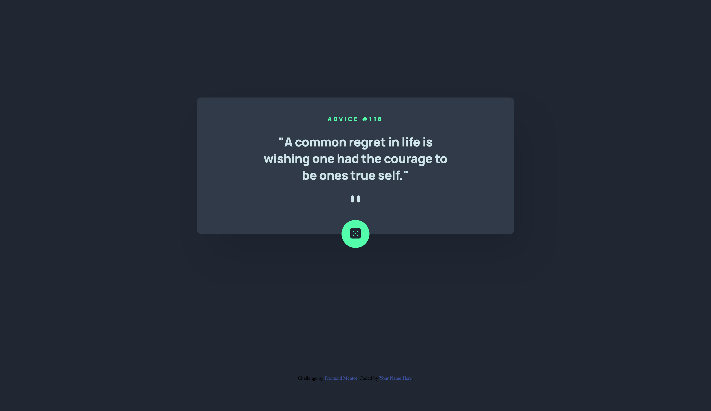

# Frontend Mentor - Advice generator app solution

This is a solution to the [Advice generator app challenge on Frontend Mentor](https://www.frontendmentor.io/challenges/advice-generator-app-QdUG-13db). Frontend Mentor challenges help you improve your coding skills by building realistic projects.

## Table of contents

- [Overview](#overview)
  - [The challenge](#the-challenge)
  - [Screenshot](#screenshot)
  - [Links](#links)
- [My process](#my-process)
  - [Built with](#built-with)
  - [What I learned](#what-i-learned)
  - [Continued development](#continued-development)
  - [Useful resources](#useful-resources)
- [Author](#author)

**Note: Delete this note and update the table of contents based on what sections you keep.**

## Overview

### The challenge

Users should be able to:

- View the optimal layout for the app depending on their device's screen size
- See hover states for all interactive elements on the page
- Generate a new piece of advice by clicking the dice icon

### Screenshot



### Links

- Solution URL: [Github]https://github.com/asaganda/FEM-advice-generator-app
- Live Site URL: [Live URL]https://bright-mousse-673a90.netlify.app/

## My process

### Built with

- Semantic HTML5 markup
- CSS custom properties
- Flexbox
- Mobile-first workflow
- Advice Slip JSON API - javascript fetch api

### What I learned

I learned how to perform a get request to a public API using the javascript fetch() api function,
learned how to handle the response and convert it to JSON data by using then() methods.
Then i was able to take the JSON data response and pass it through a function which showed the proper fields to the DOM

To see how you can add code snippets, see below:

```js
fetch(url)
    .then(response => response.json())
    .then(data => displayAdvice(data))
    .catch(error => console.log(error))
```

### Continued development

I want get more comfortable consuming APIs and fetching data to be manipulated and viewed on the DOM
I want to learn more of the additional fetch methods as well as taking some action on the fetched data

### Useful resources

The dev.to post found at link below helped me understand how to fetch the api and what to do with the response data once retrieved
https://dev.to/gbudjeakp/consuming-api-s-with-javascript-for-beginners-13el

## Author

- Website - [Andrew Saganda](http://www.saganda.us/)
- Frontend Mentor - [@asaganda](https://www.frontendmentor.io/profile/asaganda)
